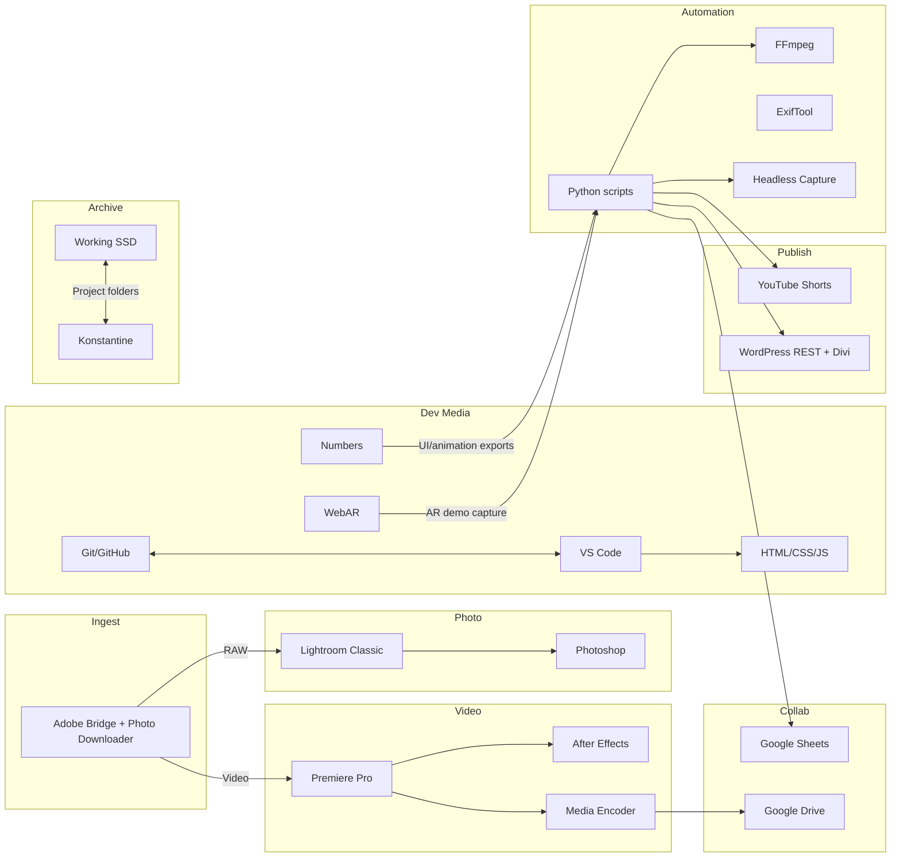
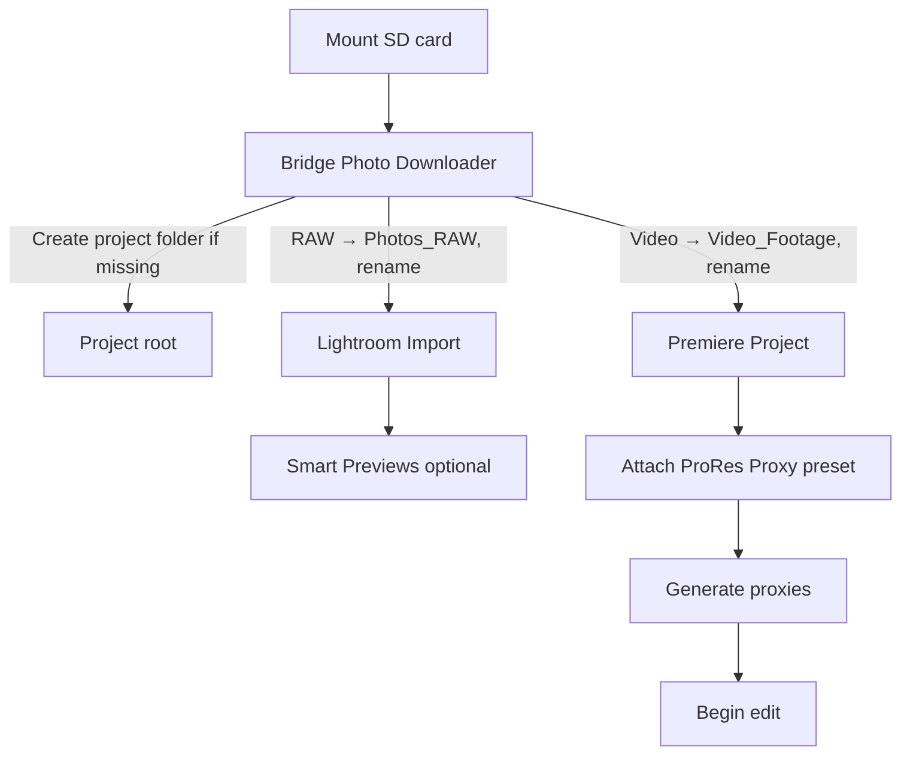
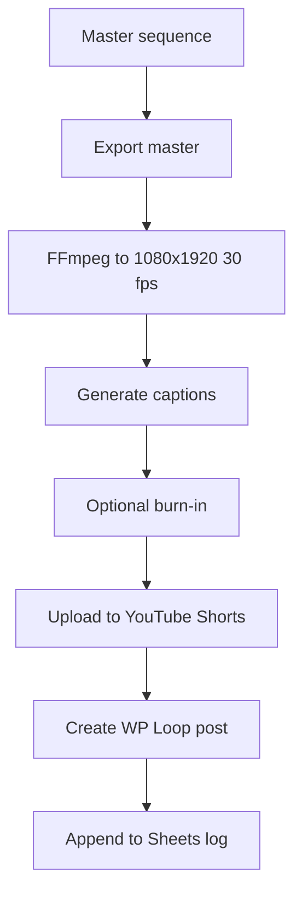
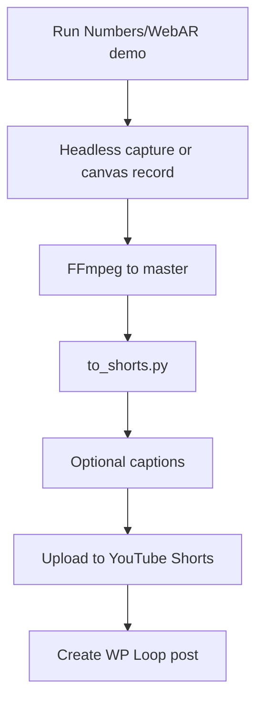

# Media Workflow System Design + Sequenced Build Plan (v2)

> **Note:** Keep this document in Markdown (`.md`) format so it can live in a GitHub repository and be version controlled alongside scripts and presets. Create a new repository (e.g., `media-workflow`) and store this file at the root as `README.md` or in a `docs/` folder (e.g., `docs/system-design.md`).

Author: Danny Goldfield • Date: 2025-08-15

## 0. Executive summary

Make video production feel as fast and reliable as your still-photo workflow, and extend the same infrastructure to handle photo, video, Numbers, and WebAR outputs. Use a single portable project structure, minimal automation, and a publish layer that feeds your WordPress sites and social channels. Build it in small, testable steps.

**Diagramming choices:**

- Architecture: **SysML-style block view** (Mermaid).
- Processes: **UML-style activity flows** (Mermaid).

---

## 1. Goals and success criteria

**Goals**

1. One project structure for photo, video, graphics, code-based animation, and WebAR.
2. Preserve existing photo workflow with minimal changes.
3. Shared automation for ingest, proxies, exports, and publishing.
4. Publish outputs to YouTube Shorts, WordPress, and optionally socials.
5. Local RAG search across your archive and docs.

**Success criteria**

- Still-photo workflow unchanged except for ingest preset and XMP writing.
- Numbers/WebAR outputs follow the same export and publish stages as video.
- Archive moves without relinks.

---

## 2. Scope and non-goals

**In scope**

- Bridge ingest, LRC photo management, Premiere/AE video, HTML/CSS/JS animation via VS Code.
- FFmpeg automation, Media Encoder presets, WordPress CPT + REST publish.
- Local-only RAG index of metadata.

**Out of scope for v1**

- Full auto posting to TikTok/IG (manual final click).
- Cloud vector DB and team MAM.

---

## 3. Constraints and assumptions

- Stable volume names across machines: `DannyGoldfield-WorkDrive` and `Konstantine`.
- Subfolders created only when needed.
- Catalog moves for photos happen inside LRC.
- Scratch and caches live “Same as Project” for portability.

---

## 4. Users and primary use cases

- Solo creator switching between photo, video, Numbers, and WebAR.
- Collaborators who need to find assets quickly.
- Use cases: mixed shoot ingest, quick proxy edit, vertical export, publish to YouTube + WordPress, archive move.

---

## 5. Requirements

**Functional**

- Ingest splits photo/video, renames with `YY-MM-DD-ProjectName-####`.
- LRC imports only `Photos_RAW`.
- Premiere uses proxies by default.
- Export scripts produce 1080×1920 30 fps H.264 shorts with optional captions.
- WordPress post auto-created with video, thumbnail, transcript.

**Non-functional**

- Portable between Mac desktop, laptop, and office iMac.
- Simple, fast scripts with minimal UI.

---

## 6. Architecture overview (SysML-style blocks)



---

## 7. Key processes (UML-style activities)

### Mixed shoot: ingest to edit



### Vertical short export and publish



### Dev capture to publish (Numbers/WebAR)



---

## 8. Data model and conventions

- Project folder: `YY-MM-DD-ProjectName`
- Files: `YY-MM-DD-ProjectName-0001.ext` (4-digit numbering)
- Subfolders created on demand: `Photos_RAW`, `Photos_Edited`, `Video_Footage`, `Proxies`, `Audio`, `Graphics`, `Project_Files`, `Exports`, `References`
- LRC manages only `Photos_RAW`; moves happen inside LRC.

---

## 9. Component specifications

**Bridge**

- Downloader preset splits by type, renames, creates only needed subfolders.
- IPTC template for author, copyright, project.

**Lightroom Classic**

- Catalog and previews in `Project_Files` on SSD.
- Write XMP to files enabled for cross-app metadata.

**Premiere Pro / After Effects**

- Project location: `Project_Files`.
- Scratch: Same as Project.
- Proxies: ProRes Proxy 1280×720 29.97 preset attached at ingest.
- Sequence presets: 4K master 29.97 and 1080×1920 social 30.

**Media Encoder**

- Watch folders:
  - `_To_Social` → H.264 1080×1920 30 fps CRF \~18
  - `_To_Master` → 4K H.264 High or ProRes 422
  - `_To_Thumbs` → JPG/PNG stills

**Scripts (Python)**

- `make_proxies.py` creates proxies in `Proxies` if missing.
- `to_shorts.py` converts master to vertical short.
- `burn_captions.py` burns SRT.
- `verify_and_rsync.sh` moves SSD → KON with checksums.
- **Capture** scripts for Numbers/WebAR using Puppeteer/Chromium or HTML5 MediaRecorder.

**WordPress**

- CPT `loop` with ACF fields: `yt_url`, `ig_url`, `tiktok_url`, `transcript`, `product_id`.
- Divi template for single Loop. Loop Grid for latest items.
- REST token auth from NameHero server.

**RAG index (deferred until after Sept 2)**

- Sources: LRC XMP, Bridge XMP, LRC CSV export, Drive file lists, GitHub README text.
- Local SQLite + embeddings. Toggle via YAML config.

---

## 10. Security and privacy

- Tokens in `.env`. Scripts read env vars.
- Index local-only in v1. Add cloud sources later per allowlist.
- Time Machine includes Working SSD and the scripts repo.

---

## 11. Failure modes and mitigations

- **Photos moved in Finder** → LRC shows missing. *Mitigation:* move inside LRC only.
- **Premiere media offline** after archive move → *Mitigation:* relink at project root. Keep identical volume names.
- **Watch folder loops** → *Mitigation:* export to staging folder, not source.
- **Disk full** during proxy/export → *Mitigation:* scripts check free space before starting.
- **REST post fails** → *Mitigation:* retry with backoff, save JSON payload for manual post.

---

## 12. Portability across machines

- Same volume names and paths.
- Presets, scripts, and docs live in `media-workflow` repo synced via GitHub.
- Scratch Same as Project.

---

## 13. Metrics and checks

- Proxy throughput fps and time per GB.
- Export duration per minute of footage.
- Time from master to published Loop.
- Count of relinks per month should be zero.

---

## 14. Open decisions

- Confirm ProRes Proxy vs LT after a week of use.
- iPhone capture defaults for frame rate and stabilization.
- RAG indexing of thumbnails vs metadata only.
- WooCommerce product creation automation.

---

## 15. Command appendix

**FFmpeg essentials**

```
# Proxies
ffmpeg -i INPUT.MOV -vf scale=1280:-2 -r 30000/1001 -c:v prores_ks -profile:v 0 -c:a copy OUTPUT_PROXY.mov

# Master to vertical short
ffmpeg -i MASTER.mp4 -vf "scale=1080:1920:force_original_aspect_ratio=increase,crop=1080:1920" \
  -r 30 -c:v libx264 -crf 18 -pix_fmt yuv420p -c:a aac -b:a 160k OUT_SHORT.mp4

# Burn captions
ffmpeg -i IN.mp4 -vf "subtitles=subs.srt:force_style='Fontsize=24,Outline=2,Shadow=0'" -c:a copy OUT_CAPTIONS.mp4
```

**Archive move**

```
rsync -avh --progress --checksum \
  "/Volumes/DannyGoldfield-WorkDrive/Projects/YY-MM-DD-ProjectName" \
  "/Volumes/Konstantine/Projects/"
```

---

## Sequenced build plan (hours)

- Phase 1 Foundations: \~10 h
- Phase 2 Automation/scripts: \~12 h
- Phase 3 WP publish: \~14 h
- Phase 4 RAG (deferred): \~16 h
- Phase 5 Test/refine: \~9 h
- Add capture scripts for Numbers/WebAR: \~8 h
- Add repos and WP tagging for project filtering: \~4 h

